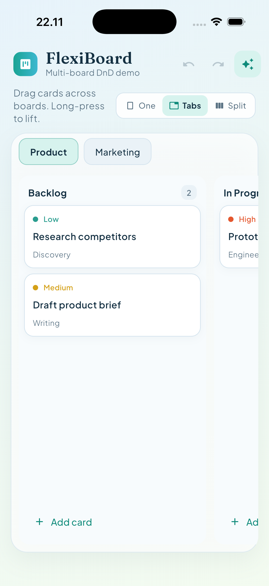

# FlexiBoard

Plug-and-play **multi-board drag-and-drop** for Flutter.



- **Mechanism first** — drag physics, placeholders, edge auto-scroll, typed move events
- **1..N boards** — single board, tab switcher (hover-to-switch while dragging), side-by-side, or paged columns
- **Fully customizable cards** via builders — or use the built-in default UI
- **Flutter-only** — no Provider, Riverpod, GetIt, or design-system lock-in
- **Optional** WIP limits, undo/redo controller, swimlanes

## Install

```yaml
dependencies:
  flexi_board:
    path: ../ # or pub version when published
```

## Quick start (defaults)

```dart
final controller = FlexiBoardController<String>(
  initial: FlexiBoardWorkspace(
    boards: [
      FlexiBoardBoard(
        id: 'main',
        title: 'Main',
        columns: [
          FlexiBoardColumn(
            id: 'todo',
            title: 'Todo',
            cards: [
              FlexiBoardCard(id: '1', data: 'Ship flexi_board'),
            ],
          ),
          FlexiBoardColumn(id: 'done', title: 'Done'),
        ],
      ),
    ],
  ),
);

FlexiBoard<String>(
  controller: controller,
  layout: FlexiBoardLayout.single,
);
```

## Custom cards + any state management

Own the workspace yourself and apply moves in `onDrop` or `onCardMoved`:

```dart
FlexiBoard<Task>(
  workspace: myWorkspace,
  layout: FlexiBoardLayout.tabs,
  cardBuilder: (context, card, details) => MyTaskTile(task: card.data),
  onDrag: (details) {
    // started | updated | cancelled
  },
  onDrop: (details) {
    if (!details.accepted || details.move == null) return;
    setState(() => myWorkspace = myWorkspace.applyMove(details.move!));
  },
  // Or keep using onCardMoved for accepted moves only:
  // onCardMoved: (move) => setState(() => myWorkspace = myWorkspace.applyMove(move)),
);
```

## Layouts

| Layout | Behavior |
|---|---|
| `FlexiBoardLayout.single` | One board canvas (horizontal scroll of columns) |
| `FlexiBoardLayout.tabs` | Tab strip; drag over a tab to switch boards, then drop |
| `FlexiBoardLayout.sideBySide` | Multiple boards visible; drag across boards |
| `FlexiBoardLayout.paged` | One column per page with side peek; drag near edges to change page |

### Paged columns (BoardView-style)

```dart
FlexiBoard(
  layout: FlexiBoardLayout.paged,
  activeColumnId: currentColumnId,
  onActiveColumnChanged: (columnId) {
    setState(() => currentColumnId = columnId);
  },
  physics: const FlexiBoardPhysics(
    pageSideMargin: 16,
    pageEdgeExtent: 80,
    pageChangeDuration: Duration(milliseconds: 400),
  ),
  ...
);
```

## Snappy cross-board drag

Use `FlexiBoardPhysics.snappy` so entering another board snaps the hover (and floating card) to the nearest column slot:

```dart
FlexiBoard(
  physics: FlexiBoardPhysics.snappy,
  layout: FlexiBoardLayout.sideBySide,
  ...
);
```

## Policies

```dart
FlexiBoard(
  policies: FlexiBoardPolicies(
    wipEnabled: true,
    allowColumnReorder: true,
    canAcceptDrop: (move, workspace) => true,
  ),
  ...
);
```

Set `wipLimit` on a column to enforce capacity when WIP is enabled.

## Example

```bash
cd example && flutter run
```

Long-press a card to drag. Use **One / Tabs / Split / Paged** to switch layouts, and the sparkle control to toggle custom cards.
